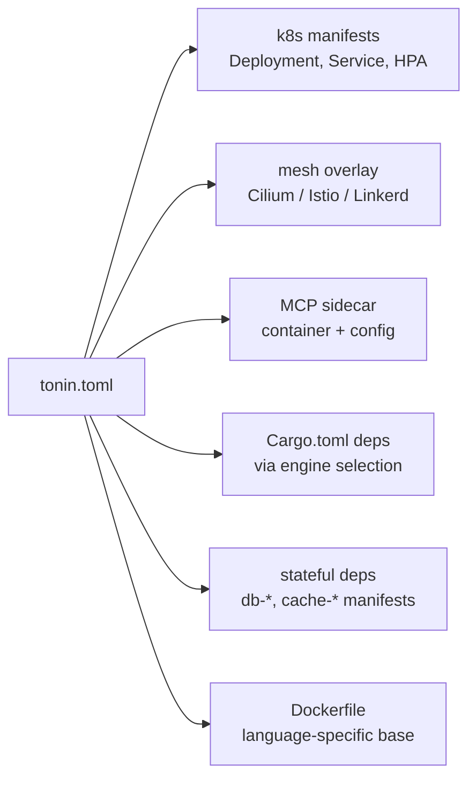

# Design principles

These four principles explain almost every design choice in tonin. If you understand them, the rest of the docs make sense.

---

## 1. Interface-first capabilities

**Rule.** Capability traits — `Cache`, `Database`, `EventBus`, `SecretStore` — live in `tonin-core`. Concrete backends (Redis, Postgres, NATS, Vault) live in their own crates (planned for 0.2). `tonin.toml` picks the implementation via `engine = "..."`.

**Why.** Backend choice is an operational decision, not a code decision. The handler should not know whether events go through NATS or Kafka, whether the cache is Redis or Memcached. If the trait is the contract, the backend becomes a swappable detail.

**Consequence you see.** Going from Redis to NATS for events is a `tonin.toml` change plus a `Cargo.toml` dep flip. Your handler keeps calling `ctx.events().publish(...)`.

```toml
# Before
[eventbus]
engine = "redis"

# After
[eventbus]
engine = "nats"
```

No handler rewrite. No `if cfg!(feature = "...")` branches in business logic.

See [07-cache.md](07-cache.md), [08-database.md](08-database.md), [09-event-bus.md](09-event-bus.md), [10-secrets.md](10-secrets.md).

---

## 2. Mesh-delegated network concerns

**Rule.** mTLS, retries, circuit breaking, cross-cluster routing, traffic shifting — all intentionally absent from the framework crates. The service mesh (Cilium, Istio, Linkerd) handles them declaratively at the network layer.

**Why.** Every framework that owns these in-process eventually owns a worse version of what the mesh already does — cert rotation bugs, retry storms, inconsistent policy across languages. The mesh runs at L4/L7 in the data plane and applies the same rules to every workload regardless of language.

**Consequence you see.**

- Service binaries stay small. No embedded cert manager, no retry policy DSL, no circuit-breaker tuning in code.
- Policies are uniform across Rust, Python, and TypeScript services in the same mesh.
- Mesh dashboards (Kiali, Hubble, Linkerd Viz) work without per-service instrumentation.
- Switching mesh = changing `[deploy].mesh` in `tonin.toml` and re-rendering.

See [13-service-mesh.md](13-service-mesh.md).

---

## 3. MCP-by-default

**Rule.** Every gRPC method is exposed as an MCP tool by a co-located sidecar (`:50052` next to gRPC on `:50051`). One attribute on the impl block plus one builder call does it:

```rust
#[tonin::mcp_expose]
impl Greeter for GreeterImpl {
    async fn say_hello(&self, req: Request<HelloRequest>) -> Result<Response<HelloReply>, Status> {
        // ...
    }
}

// in main()
let impl_ = GreeterImpl::new(state.clone());
Service::new("greeter")
    .handler(GreeterServer::new(impl_.clone()))
    .enable_mcp_with(move || Ok(GreeterImplMcpAdapter::new(impl_.clone())))
    .run().await
```

`#[mcp_expose]` synthesises `GreeterImplMcpAdapter` from the impl block; `.enable_mcp_with(...)` is what wires the adapter into the runtime. See [04-mcp-exposure.md](04-mcp-exposure.md) for the full flow.

**Why.** LLM-callable services should not be a separate project. If a service speaks gRPC, the schema is already there — `.proto` files describe inputs, outputs, and method names. Generating an MCP surface from the same source is mechanical, so it should be free.

**Consequence you see.** Services are LLM-callable from day one. No second IDL, no parallel handler. The sidecar forwards MCP tool calls to the gRPC server in the same pod.

See [04-mcp-exposure.md](04-mcp-exposure.md).

---

## 4. `tonin.toml` is the single source of truth

**Rule.** Service name, language, mesh choice, replicas, resources, MCP sidecar toggle, stateful dependencies, codec — all declared in `tonin.toml`. The CLI re-renders everything else (k8s manifests, Dockerfile, sidecar config) from it.

**Why.** Two sources of truth become zero sources of truth the moment they disagree. If the Deployment YAML says 3 replicas and `tonin.toml` says 5, which is correct? Centralising the declaration makes the answer obvious: `tonin.toml`, and the YAML is rebuilt.

**Consequence you see.**

- No hand-edited YAML drift between repo and cluster. Edit `tonin.toml`, run `tonin k8s render`, commit the regenerated manifests.
- Code review focuses on the declarative change, not 200 lines of YAML churn.
- New environments are a TOML overlay, not a YAML fork.

```toml
[service]
name    = "greeter"
language = "rust"
codec    = "prost"   # tonic-build today; buffa-based plugin planned

[deploy]
mesh     = "cilium"
replicas = 3

[resources]
cpu    = "100m"
memory = "128Mi"

[mcp]
enabled = true

[cache]
engine = "redis"
```

See [12-kubernetes-deploy.md](12-kubernetes-deploy.md).

---

## How `tonin.toml` flows through the system



One file in, every deployable artefact out.

---

## See also

- [02-architecture.md](02-architecture.md) — how the principles map to the actual crate layout
- [12-kubernetes-deploy.md](12-kubernetes-deploy.md) — `tonin.toml` to YAML in practice
- [13-service-mesh.md](13-service-mesh.md) — what the mesh takes off your plate
- [Canonical example: greeter](https://github.com/Rushit/tonin/tree/main/examples/greeter)
