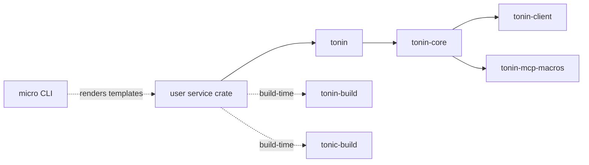
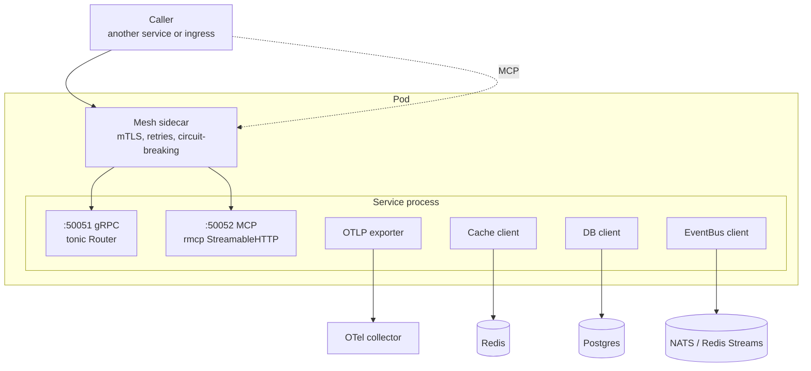
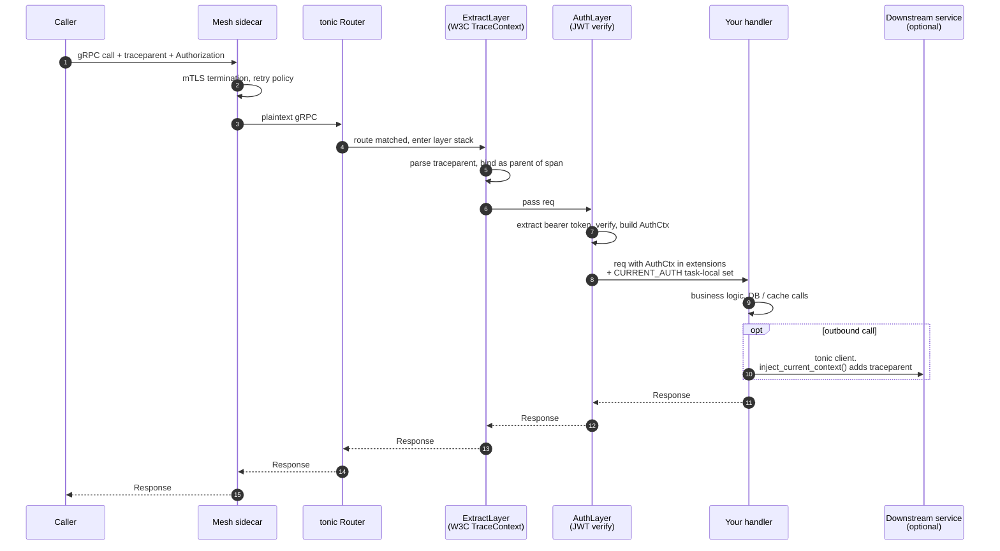
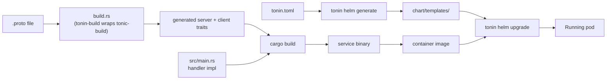

# 02 — Architecture

System architecture: crates, runtime layout, request flow, build & deploy.

This page is the map you keep open while reading the rest of the docs. It does not teach you how to *use* anything — it shows you *where things live* and *which code runs when*. For the "why" behind these choices, see [01-principles.md](01-principles.md). For the user-facing "how", jump to [03-grpc-service.md](03-grpc-service.md).

## What it gives you

- A one-screen mental model of which crate owns what
- A picture of a running pod — every port, every sidecar, every outbound dependency
- A request trace from caller to handler showing where mesh, tracing, and auth each plug in
- A build-and-deploy flow that explains how `.proto` + `tonin.toml` become a running pod

## Crate map

tonin is one Cargo workspace. Five library crates plus one CLI binary.

| Crate                 | Role                                                                      | Depends on                                  |
| --------------------- | ------------------------------------------------------------------------- | ------------------------------------------- |
| `tonin`             | Umbrella re-export. What service authors put in `Cargo.toml`.             | `tonin-core`                              |
| `tonin-core`        | `Service` builder, runtime layers, capability traits, telemetry, MCP host | `tonin-client`, `tonin-mcp-macros`, tonic, rmcp, opentelemetry |
| `tonin-client`      | Small peer-service client primitives: `AuthCtx`, retry, breaker, propagate | tonic only — deliberately tiny             |
| `tonin-mcp-macros`  | Proc-macro `#[mcp_expose]`                                                | syn / quote                                 |
| `tonin-build`       | `build.rs` helper wrapping `tonic-build` with tonin conventions         | `tonic-build`                               |
| `micro` (crates/tonin/)  | The `micro` CLI binary — `service`, `proto`, `k8s` subcommands            | `tonin-codegen` (workspace-internal)      |

Dependency direction:

A few constraints baked into the split:

- **`tonin-mcp-macros` must be its own crate** — proc-macros in Rust have to live in `proc-macro = true` crates. It is re-exported as `tonin::mcp_expose` so users never see the macro crate name.
- **`tonin-client` is intentionally minimal.** Peer services that only need to *call* another tonin service pull `tonin-client` instead of the full framework. Keeps caller dep trees small.
- **`tonin-core` ships submodules** (`transport`, `discovery`, `mcp`, `telemetry`, `auth`, `traits`, `state`, `instrumented`, `job`) rather than separate crates in 0.1. The split into `tonin-postgres`, `tonin-redis`, `tonin-auth-jwt` is planned for 0.2; the trait surface in `tonin_core::traits` is the seam that stays stable across that move.
- **`tonin-build`** is a *build-dependency*. Service crates put it under `[build-dependencies]`, not `[dependencies]` — it does not ship into the binary.

## Runtime layout

A running tonin pod has two ports owned by the service process plus whatever the mesh injects. Capability impls (cache, DB, event bus) are clients reaching out to backing services elsewhere in the cluster.

Things worth noticing in this picture:

- **gRPC and MCP share the process.** Same `tokio` runtime, same `AuthCtx` task-local, same DB / cache handles. MCP is not a separate sidecar binary — it is a second port served by the same `Service::run` call (see `tonin_core::mcp::spawn_with`). Enabled via `.enable_mcp()` or `.enable_mcp_with(...)` on the `Service` builder.
- **Mesh sidecar owns mTLS and retries.** The framework does not implement either. See [13-service-mesh.md](13-service-mesh.md).
- **OTLP is push-based, zero-config.** `Service::new` calls `telemetry::init` as a side effect; set `TONIN_TELEMETRY=off` to disable.
- **Capability clients are in-process.** `Cache`, `Database`, `EventBus` are `Arc<dyn Trait>` handles owned by the handler; they hold connections to backing services but are not separate processes.

## Request flow

What runs, in what order, when a caller invokes a gRPC method on a tonin service with `.with_auth(...)` and `.enable_mcp_with(...)` installed.

Where each concern lives:

- **mTLS, retries, cross-cluster routing → mesh sidecar.** Not in the framework. See [13-service-mesh.md](13-service-mesh.md).
- **Trace context extraction → `telemetry::propagate::ExtractLayer`** (`crates/tonin-core/src/telemetry/propagate.rs`). Installed once in `Service::handler` the first time a handler is registered.
- **Auth → `auth::AuthLayer`** (`crates/tonin-core/src/auth/layer.rs`). Same point of installation. Puts the `AuthCtx` in both request extensions and `CURRENT_AUTH` task-local; the latter is what lets generated clients propagate identity on outbound calls without the handler threading it manually. See [06-authentication.md](../docs/06-authentication.md) when written.
- **Outbound propagation → `telemetry::propagate::inject_current_context`.** Generated clients call this on every outbound RPC so the downstream service sees this service's current span as the parent.

Layer order matters: `ExtractLayer` runs **before** `AuthLayer`, so an auth rejection still has a trace context (and an error span gets parented correctly). The order is fixed by `Service::handler` — you do not configure it.

## Build / deploy flow

The framework intentionally does not generate code at runtime. Everything is regular Cargo build, regular `kubectl apply`. The CLI's job is filling in the boring boilerplate.

The pipeline in words:

1. **Author** the `.proto`, the handler impl in `src/main.rs`, and the `tonin.toml` (service name, mesh, replicas, capability engines).
2. **Codegen.** The service's `build.rs` calls `tonin_build` (a thin wrapper around `tonic-build`) on every `cargo build`. The generated server trait, client stub, and any `#[mcp_expose]` adapters land in `OUT_DIR`.
3. **Compile.** `cargo build` produces a single binary. No `micro` step required at this stage — the CLI is not in the build hot path.
4. **Render manifests.** `tonin helm generate` reads `tonin.toml`, picks the right mesh overlay (Cilium / Istio / Linkerd) and stateful templates (`db-*`, `cache-*`), writes the Helm chart under `examples/<svc>/chart/`. The generated chart is part of the deployment artifact. See [12-kubernetes-deploy.md](12-kubernetes-deploy.md).
5. **Deploy.** `tonin helm upgrade` runs `helm upgrade --install` with values and namespace resolved. The mesh injects its sidecar; the pod comes up serving gRPC on `:50051` and — if enabled — MCP on `:50052`.

The canonical end-to-end shape: [examples/greeter](https://github.com/Rushit/tonin/tree/main/examples/greeter).

## See also

- [01-principles.md](01-principles.md) — design principles behind the splits on this page
- [03-grpc-service.md](03-grpc-service.md) — building your first service against this architecture
- [13-service-mesh.md](13-service-mesh.md) — what the mesh sidecar handles and how it's configured
