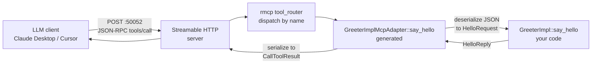

# MCP exposure

Turn every gRPC method into an LLM-callable MCP tool with one attribute.

## What you get

- Every `async fn` on your gRPC impl becomes an MCP tool — automatically.
- A second port (default `:50052`) speaks the Model Context Protocol over
  Streamable HTTP. LLM clients (Claude Desktop, Cursor, Continue, Claude Code)
  discover and call your tools with zero glue code.
- Tool name = method name. Tool description = the method's doc comment.
  Tool input schema = the request proto's `JsonSchema`. No hand-written tool
  registry, no separate handler tree.
- The MCP tool calls into the **same** impl that serves gRPC. One code path,
  two transports.
- Multi-client friendly: Streamable HTTP supports many concurrent LLM clients
  on one port (unlike stdio).

## Enabling it

Two changes to a normal tonic service.

**Before** — a plain gRPC service:

```rust
#[tonic::async_trait]
impl Greeter for GreeterImpl {
    async fn say_hello(
        &self,
        req: Request<HelloRequest>,
    ) -> Result<Response<HelloReply>, Status> {
        Ok(Response::new(HelloReply {
            message: format!("hi {}", req.into_inner().name),
        }))
    }
}

// main.rs
Service::new("greeter")
    .handler(GreeterServer::new(impl_))
    .run()
    .await
```

**After** — add `#[tonin::mcp_expose]` and a `.enable_mcp_with(...)` call:

```rust
#[tonic::async_trait]
#[tonin::mcp_expose]
impl Greeter for GreeterImpl {
    /// Greet a user by name.
    async fn say_hello(
        &self,
        req: Request<HelloRequest>,
    ) -> Result<Response<HelloReply>, Status> {
        Ok(Response::new(HelloReply {
            message: format!("hi {}", req.into_inner().name),
        }))
    }
}

// main.rs
Service::new("greeter")
    .handler(GreeterServer::new(impl_.clone()))
    .enable_mcp_with(move || Ok(GreeterImplMcpAdapter::new(impl_.clone())))
    .run()
    .await
```

That's it. `cargo run` now exposes:

- gRPC on `:50051` (your existing clients keep working)
- MCP over Streamable HTTP on `:50052` (LLM clients connect here)

The doc comment on `say_hello` becomes the tool description an LLM sees when
listing tools — write them like you'd write a tool docstring.

## What the macro generates

`#[tonin::mcp_expose]` re-emits your `impl` block unchanged, then emits a
sibling adapter type:

- `<Impl>McpAdapter` — a `Clone` struct holding `Arc<YourImpl>` and an
  `rmcp::ToolRouter`. For `GreeterImpl`, it generates `GreeterImplMcpAdapter`.
- One `#[tool(description = "...")]` method per async gRPC method. Each tool:
  1. Deserializes the MCP request JSON into the proto request type.
  2. Wraps it in `tonic::Request::new(...)`.
  3. Calls `self.inner.<method>(req).await` — the same code gRPC runs.
  4. Serializes the response back to JSON for the LLM client.
- A `ServerHandler` impl that advertises tool capability and protocol version
  `2024-11-05`.

Methods that aren't `async fn(&self, Request<ReqT>) -> Result<Response<RespT>, Status>`
are skipped (streaming and non-gRPC-shaped methods don't get auto-exposed).

## Wire protocol

- **Transport**: Streamable HTTP (not stdio). One HTTP endpoint, many clients,
  long-lived sessions, works through standard load balancers and the service
  mesh.
- **Default port**: `:50052`. Override at runtime via `.mcp_addr(addr)` on the `Service` builder; a `[mcp]` TOML section is not yet wired through the codegen.
- **Endpoint path**: served at the connection root — rmcp's `StreamableHttpService` handles the request directly with no path prefix.
- **Schema requirements**: `ReqT` and `RespT` must implement
  `serde::Serialize + serde::Deserialize + schemars::JsonSchema`. The Rust
  scaffold's `build.rs` (via `tonin-build`) configures `tonic-build` to
  derive all three on generated message types, so this is automatic for any
  proto built through the standard scaffold.
- **Impl bounds**: your impl type must be `Clone + Send + Sync + 'static`.

## How a tool call flows



The bottom half — `GreeterImpl::say_hello` — is the **same** function the
gRPC server calls. Auth, telemetry, and capability state (cache, database)
behave identically on both paths.

## Trying it

The greeter example ships with `#[mcp_expose]` enabled. After `cargo run`,
point an MCP client at `http://localhost:50052/mcp` and you'll see
`say_hello` in its tool list.

See the canonical sample:
<https://github.com/Rushit/tonin/tree/main/examples/greeter>

## See also

- [03-grpc-service.md](03-grpc-service.md) — the gRPC service the MCP adapter wraps.
- [13-service-mesh.md](13-service-mesh.md) — exposing the MCP port through Cilium / Istio / Linkerd.
