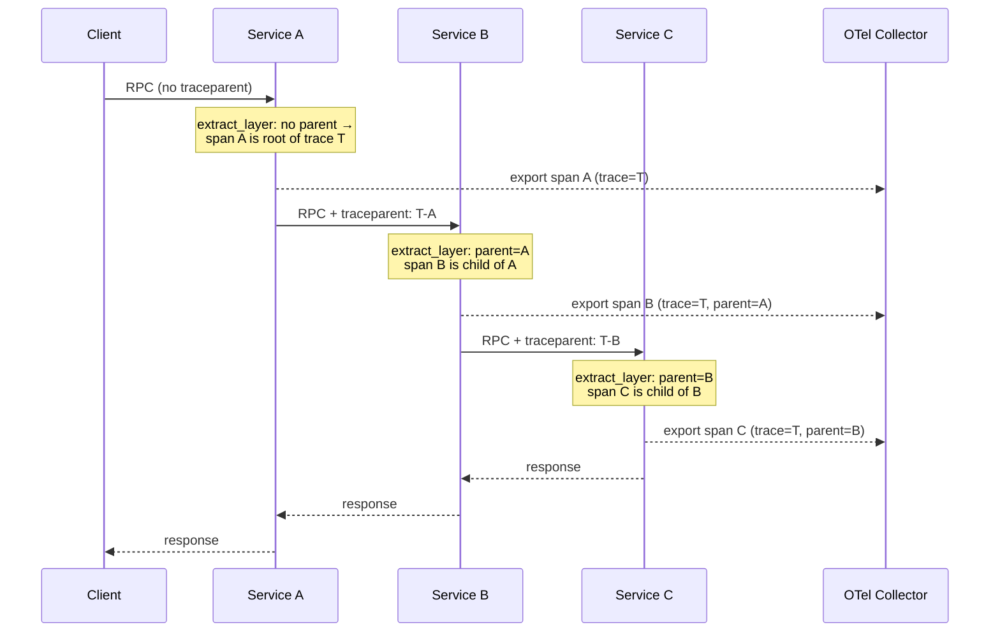

# Telemetry

Zero-config OTLP tracing and W3C TraceContext propagation across every gRPC hop.

## What you get

- **One-line bootstrap.** `Service::new(...)` installs the global tracer, exporter, and W3C propagator. You never touch the OTel SDK directly.
- **OTLP exporter out of the box.** Spans are pushed over gRPC to an OpenTelemetry collector at the cluster-default endpoint, or wherever `OTEL_EXPORTER_OTLP_ENDPOINT` points.
- **Structured logs unified with traces.** `tracing` events are emitted as structured logs and attached to the active span, so log lines carry the same `trace_id` as their span.
- **W3C `traceparent` extracted on every inbound RPC.** A `tower` layer reads the header and parents your handler's span to the caller's span.
- **`traceparent` injected on every outbound RPC.** Generated client code calls `propagate::inject_current_context` so the next hop sees you as its parent.
- **OTel semantic conventions for capabilities.** `Instrumented<Cache>`, `Instrumented<Database>`, and `Instrumented<EventBus>` emit spans tagged with `db.system`, `messaging.system`, and the rest of the [semconv](https://opentelemetry.io/docs/specs/semconv/) vocabulary, so your APM groups them correctly.
- **End-to-end trace across services.** A request fanning through three services lands in your backend as a single trace with the parent/child structure intact.

## Configuration

Configuration is environment-driven, using OpenTelemetry standard variable names. No code changes required to point at a different collector or rename the service.

| Variable | Default | Purpose |
| --- | --- | --- |
| `OTEL_EXPORTER_OTLP_ENDPOINT` | `http://otel-collector.observability.svc.cluster.local:4317` | gRPC endpoint of your OTel collector. |
| `OTEL_SERVICE_NAME` | name passed to `Service::new` | Overrides the `service.name` resource attribute. |
| `RUST_LOG` | `info` | Log filter (standard `tracing-subscriber` syntax). The framework reads this via `EnvFilter::try_from_default_env()`. |
| `TONIN_TELEMETRY` | unset (on) | Set to `off` to disable OTLP export entirely; structured stdout logs still print. |

Typical k8s deployment:

```yaml
env:
  - name: OTEL_EXPORTER_OTLP_ENDPOINT
    value: "http://otel-collector.observability.svc.cluster.local:4317"
  - name: RUST_LOG
    value: "info,greeter=debug"
```

No code change is needed to swap collectors — point the env var elsewhere and redeploy.

## Propagation

tonin uses the [W3C TraceContext](https://www.w3.org/TR/trace-context/) propagator. Every cross-service boundary carries a `traceparent` header (and, if configured, `tracestate`).

**Inbound (server).** The framework installs `propagate::extract_layer()` as part of the tonic Router that `Service::handler(...)` builds — the first `handler()` call wraps the router with the extract layer (alongside the auth layer). For every incoming request it reads `traceparent` from the gRPC metadata, builds an OTel `Context`, and binds it to the request span as its parent — your handler's span becomes a child of the caller's span without any code on your part.

**Outbound (client).** Generated client stubs (and the `tonin-client` helpers) call `inject_current_context` before sending. The current span's W3C context is written into the outbound metadata so the next service sees you as parent:

```rust,no_run
use tonin::core::telemetry::propagate;

# fn example(req_payload: ()) {
let mut req = tonic::Request::new(req_payload);
propagate::inject_current_context(req.metadata_mut());
# }
```

The same idea applies to async messaging. `Instrumented<EventBus>` uses `inject_current_context_map` on publish and `extract_context_from_map` on receive, so a span produced by service A on `publish` shows up as the parent of the consumer span in service B — even though there is no direct RPC between them.

## Span semantics

Capability decorators emit attributes drawn from the OpenTelemetry semantic conventions so vendor backends (Honeycomb, Tempo, Datadog, Jaeger, etc.) classify them correctly. Exact names below match `crates/tonin-core/src/instrumented.rs`.

| Capability | Span name | Key attributes |
| --- | --- | --- |
| `Instrumented<Cache>` | `cache.op` | `cache.system` (e.g. `"redis"`), `cache.op` (`get` / `set` / `set_nx` / `del`), `cache.key.hash` (salted hash; key strings are never recorded) |
| `Instrumented<SecretStore>` | `secret.get` | `secret.provider` (e.g. `"k8s"`); the key name is intentionally never recorded |
| `Instrumented<EventBus>` (publish) | `messaging.publish` | `messaging.system`, `messaging.destination.name`, `messaging.destination.kind = "topic"`, `messaging.message.id` |
| `Instrumented<EventBus>` (per-message processing) | `messaging.process` | `messaging.system`, `messaging.destination.name`, `messaging.consumer.id`, `messaging.message.id`, `messaging.delivery_attempt` |
| `Instrumented<Database>` | _pass-through, no span_ | The framework does not wrap query calls; sqlx / sea-orm emit their own spans against the same tracer provider, so they join the request trace automatically. |
| gRPC server (per RPC) | tonic-emitted | The framework installs trace context but does not add its own RPC span; tonic / your tower middleware can add `rpc.system="grpc"` etc. if configured. |

Opt-in pattern: wrap your capability impl once with `Instrumented::with_defaults(Arc::new(my_impl))` before storing it in handler state. There is no auto-wrapping yet (it lands with the `Service` capability accessors in 0.2).

## Disabling for tests and dev

For unit tests or local runs without a collector, disable the exporter:

```bash
TONIN_TELEMETRY=off cargo test
TONIN_TELEMETRY=off cargo run -p greeter
```

This skips the OTLP exporter setup entirely but still installs a `tracing-subscriber` formatter, so `info!` / `debug!` lines print to stdout. There is no panic if the collector is unreachable in normal mode either — the OTLP exporter logs and drops batches — but `off` is the cleaner choice when you know there is no collector.

## End-to-end trace across a service chain

A single client call into service A, which fans out to B and then C, lands in your backend as one trace because `traceparent` is carried at every hop.



In the collector all three spans share `trace_id=T` and form a single tree — A → B → C — visualizable as one waterfall in any OTel-compatible UI.

For the full working example, see [examples/greeter](https://github.com/Rushit/tonin/tree/main/examples/greeter).

## See also

- [03-grpc-service.md](03-grpc-service.md) — how `Service::new` wires the telemetry layer into the gRPC stack.
- [02-architecture.md](02-architecture.md) — where the telemetry crate sits relative to the rest of the runtime.
