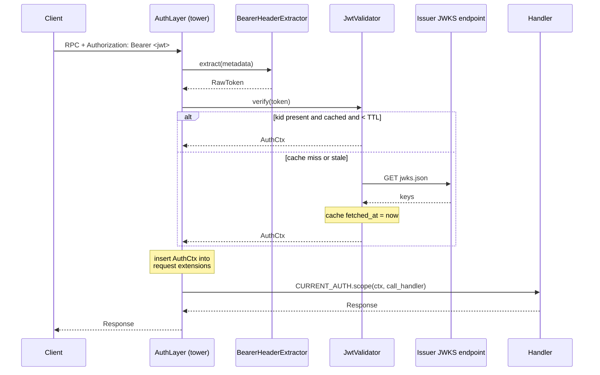

# Authentication

JWT validation, JWKS fetch, and an `AuthCtx` your handlers can read without plumbing.

## What you get

- **Bearer-token extraction.** A `tower` layer reads `Authorization: Bearer <token>` from gRPC metadata on every inbound call.
- **JWT signature verification.** Algorithm, `exp`, `iss`, and `aud` are checked against the configured issuer and audience.
- **JWKS auto-fetch and cache.** Public keys are pulled from your issuer's JWKS URL on first use, cached in memory, and refreshed on miss (TTL configurable, default 600s). You never embed keys in your service.
- **`AuthCtx` in two places.** The verified caller identity is inserted into the request extensions *and* into a Tokio task-local. Handlers read whichever is convenient; spawned tasks capture the value explicitly.
- **Anonymous mode.** Public APIs opt out with one builder call. Handlers still receive a well-formed `AuthCtx { kind: Anonymous }`.
- **Custom verifiers.** Need Okta-specific claims, opaque tokens, or a chained fallback? Implement `TokenVerifier` and pass it in.
- **Service-to-service tokens.** Background jobs mint an `AuthCtx` representing the local service identity via `auth::service_token()`, propagated to downstream calls the same way user identity is.

## Quickest path

```rust
use tonin::Service;
use tonin::auth::default::JwtValidator;

#[tokio::main]
async fn main() -> tonin::Result<()> {
    Service::new("greeter")
        .with_auth(JwtValidator::from_env()?)
        .handler(my_grpc_impl)
        .run()
        .await
}
```

Set these in your environment (typically through the k8s manifest the CLI renders for you):

| Variable | Required | Purpose |
| --- | --- | --- |
| `TONIN_AUTH_ISSUER` | yes | Expected `iss` claim. |
| `TONIN_AUTH_AUDIENCE` | yes | Expected `aud` claim. |
| `TONIN_AUTH_JWKS_URL` | yes | Public-key endpoint; cached and refreshed on cache miss. |
| `TONIN_AUTH_JWKS_TTL_SECS` | no (default 600) | Max age of the cached JWKS before a refresh is forced. |
| `TONIN_AUTH_INSECURE_DEV` | no | Set to `1` to accept any well-formed JWT without signature checks. Logs a loud warning on every call. Local dev only. |

That is the whole setup. No code changes to swap identity providers — point `TONIN_AUTH_ISSUER` and `TONIN_AUTH_JWKS_URL` at a different IdP and redeploy.

## Reading the caller in a handler

`AuthCtx` is delivered two ways. Pick whichever matches the call site.

```rust
use tonin::auth::{AuthCtx, current, CURRENT_AUTH};
use tonic::{Request, Response, Status};

async fn say_hello(
    &self,
    req: Request<HelloRequest>,
) -> Result<Response<HelloReply>, Status> {
    // (1) Lift from request extensions — convenient where you already have `req`.
    let caller = req.extensions().get::<AuthCtx>().cloned().unwrap_or_else(AuthCtx::anonymous);

    // (2) Or read the task-local from deep inside a helper that doesn't see `req`.
    let same = current();                       // helper that returns anonymous if missing
    CURRENT_AUTH.with(|c| tracing::info!(sub = %c.subject, "billing op"));

    tracing::info!(subject = %caller.subject, scopes = ?caller.scopes, "hello");
    Ok(Response::new(HelloReply { message: format!("hi, {}", caller.subject) }))
}
```

**Spawn pitfall.** `CURRENT_AUTH` is task-local. If you `tokio::spawn` and call a downstream service from the spawned task, capture the value first:

```rust
let auth = current();
tokio::spawn(async move {
    billing.charge_as(&auth, invoice_id).await
});
```

## Anonymous mode

For read-only public APIs, opt out of token enforcement:

```rust
Service::new("public-catalog")
    .without_auth()        // missing/invalid token → anonymous, not 401
    .handler(catalog_impl)
    .run().await
```

The auth layer still runs and still populates the request extension and task-local — handlers always receive an `AuthCtx`. With `without_auth()` the kind is `Anonymous`:

```rust
use tonin::auth::PrincipalKind;

let caller = current();
match caller.kind {
    PrincipalKind::Anonymous => render_public_view(),
    _                        => render_personalized_view(&caller),
}
```

Mix and match: a service can be `without_auth()` at the framework level and still gate specific RPCs by inspecting `caller.kind` inside the handler.

## Custom verifier

Implement `TokenVerifier` when you need claim semantics that don't fit the default JWT validator (Okta `groups`, opaque introspection, mTLS-derived identity, etc.). The default extractor still pulls the bearer token; only the verification step changes.

```rust
use async_trait::async_trait;
use tonin::auth::{AuthCtx, AuthError, RawToken, TokenVerifier, PrincipalKind};

struct OktaVerifier { client: reqwest::Client, introspection_url: String }

#[async_trait]
impl TokenVerifier for OktaVerifier {
    async fn verify(&self, token: &RawToken) -> Result<AuthCtx, AuthError> {
        let resp: OktaIntrospect = self.client
            .post(&self.introspection_url)
            .form(&[("token", &token.value)])
            .send().await.map_err(|e| AuthError::Transport(e.to_string()))?
            .json().await.map_err(|e| AuthError::Verification(e.to_string()))?;
        if !resp.active { return Err(AuthError::Expired); }
        Ok(AuthCtx {
            subject: resp.sub,
            scopes: resp.scope.split_whitespace().map(String::from).collect(),
            kind: PrincipalKind::User,
            ..AuthCtx::anonymous()
        })
    }
}

Service::new("billing")
    .with_auth(OktaVerifier { /* ... */ })
    .handler(billing_impl).run().await
```

For "try JWT first, then opaque introspection," compose with `ChainVerifier`:

```rust
use tonin::auth::{ChainVerifier, default::JwtValidator};

let chain = ChainVerifier::new()
    .add(JwtValidator::from_env()?)
    .add(OktaVerifier::new());

Service::new("billing").with_auth(chain).handler(...).run().await
```

## Service-to-service

Background jobs and queue consumers do not have an inbound request to propagate identity from. They mint a service-identity `AuthCtx` on demand:

```rust
use tonin::auth;

async fn nightly_reconcile() -> tonin::Result<()> {
    let me = auth::service_token().await?;          // PrincipalKind::Service
    billing.reconcile_as(&me, today()).await?;
    Ok(())
}
```

The default minter (`HttpServiceTokenMinter`) POSTs to `TONIN_AUTH_SERVICE_TOKEN_URL` and caches the result until 60s before expiry. Configure it through:

| Variable | Purpose |
| --- | --- |
| `TONIN_AUTH_SERVICE_TOKEN_URL` | Endpoint that mints the service token. |
| `TONIN_AUTH_SERVICE_AUDIENCE` | `aud` requested for the token. |
| `TONIN_AUTH_SERVICE_TOKEN_SCOPES` | Comma-separated scopes. |

Downstream calls made with this `AuthCtx` propagate exactly the same way a user `AuthCtx` does — the next service sees a verified caller with `kind=Service`. See [14-background-jobs.md](14-background-jobs.md) for the full job runtime.

## Under the hood

Inbound flow on every RPC:



The same `AuthCtx` is available to the handler via `req.extensions()` and via the `CURRENT_AUTH` task-local for the full duration of the call — including across `await` points, but not across `tokio::spawn` boundaries (capture explicitly).

For the full working example, see [examples/greeter](https://github.com/Rushit/tonin/tree/main/examples/greeter).

## See also

- [03-grpc-service.md](03-grpc-service.md) — where `with_auth` plugs into the `Service` builder.
- [14-background-jobs.md](14-background-jobs.md) — service-token minting in the job runtime.
