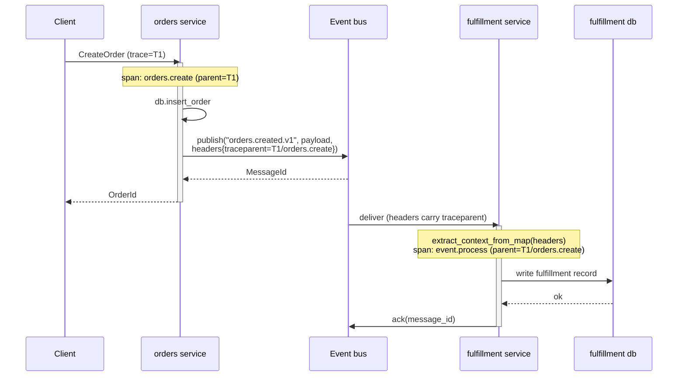

# Event bus

At-least-once publish/subscribe with explicit ack, behind a single trait that swaps Redis Streams, NATS, or Kafka by changing one TOML line.

## What you get

- **At-least-once delivery** with explicit `ack` / `nack`. Messages stay in flight until you acknowledge, so a panicking handler redelivers instead of silently dropping work.
- **W3C trace context propagation through headers** — a `traceparent` header is injected on publish, so the consumer's processing span joins the producer's trace automatically (see [05-telemetry.md](05-telemetry.md)).
- **Engine-agnostic API.** The same handler code runs on Redis Streams, NATS, or Kafka. Switching engines is a `tonin.toml` change plus a `Cargo.toml` dep flip — never a handler rewrite.
- **Consumer groups** for horizontal scaling. Multiple pods in the same group split the workload; distinct groups each receive every message (fan-out).
- **Per-message ack/nack** with optional backoff delay for transient failures.
- **Compile-time double-ack prevention** — `ack` and `nack` consume `self`, so you cannot accidentally acknowledge a message twice.

## Trait surface

The capability lives in `tonin_core::traits::event_bus`. The full trait:

```rust
#[async_trait]
pub trait EventBus: Send + Sync + 'static {
    async fn publish(&self, subject: &str, payload: &[u8]) -> Result<MessageId, Error>;

    async fn publish_with_headers(
        &self,
        subject: &str,
        payload: &[u8],
        headers: HashMap<String, String>,
    ) -> Result<MessageId, Error>;

    async fn subscribe(
        &self,
        subject_pattern: &str,
        group: &str,
        opts: SubscribeOptions,
    ) -> Result<Subscription, Error>;

    fn system(&self) -> &'static str; // "redis" | "nats" | "kafka"
}
```

A `Subscription` is a `Stream<Item = DeliveredMessage>`. Each `DeliveredMessage` carries:

```rust
pub struct DeliveredMessage {
    pub id: MessageId,
    pub subject: String,
    pub payload: Vec<u8>,
    pub headers: HashMap<String, String>,
    pub delivery_attempt: u32,
    // ack handle is private; use the methods below
}

impl DeliveredMessage {
    pub async fn ack(self) -> Result<(), Error>;
    pub async fn nack(self) -> Result<(), Error>;
    pub async fn nack_with_delay(self, delay: Duration) -> Result<(), Error>;
}
```

`SubscribeOptions` controls consumer behavior:

```rust
pub struct SubscribeOptions {
    pub start: StartPosition,            // Now | Earliest
    pub visibility_timeout: Duration,    // default 30s — how long until redeliver
    pub max_in_flight: usize,            // default 32
}
```

The `Acker` trait is the backend-supplied per-message handle. Service code never names it — it's there so out-of-tree engine crates can construct `DeliveredMessage`. Users only see `ack` / `nack` / `nack_with_delay` on the message.

## Engines

The engine selection will live under `[eventbus]` in `tonin.toml`. The Redis engine may share the existing `[cache]` Redis connection:

```toml
# Shape preview — [eventbus] is NOT yet parsed by the CLI codegen in 0.1.
# Land path: stateful.rs gains a RawEventBus struct; engine selection wires
# the corresponding tonin-redis / tonin-nats / tonin-kafka impl.
[eventbus]
engine = "redis"   # 0.2: redis streams; later: "nats" | "kafka"
url    = "redis://eventbus:6379"
```

| Engine | `system()` | Status |
| --- | --- | --- |
| Redis Streams | `"redis"` | Planned 0.2 |
| NATS JetStream | `"nats"` | Deferred |
| Kafka | `"kafka"` | Deferred |

The trait is stable in 0.1; engine implementations and the `[eventbus]` TOML
parser follow.

## Publishing

In 0.1 you construct your own `Arc<dyn EventBus>` (against your engine impl), wrap it in `Instrumented::with_defaults(...)` for telemetry, and store it in your handler-state struct. Once `tonin-redis` ships, a builder accessor will hand you the wired-and-wrapped impl.

```rust,ignore

```rust
use serde_json::json;
use std::collections::HashMap;

async fn create_order(state: AppState, req: CreateOrderRequest) -> Result<OrderId, Error> {
    let id = state.db.insert_order(&req).await?;

    let payload = serde_json::to_vec(&json!({
        "order_id": id,
        "customer_id": req.customer_id,
        "total_cents": req.total_cents,
    }))?;

    let mut headers = HashMap::new();
    headers.insert("idempotency-key".into(), id.to_string());

    state.bus
        .publish_with_headers("orders.created.v1", &payload, headers)
        .await?;

    Ok(id)
}
```

Use `publish` for the common case and `publish_with_headers` when you need idempotency keys, tenant tags, or any other consumer-visible metadata. The instrumented decorator adds `traceparent` to whatever headers you supply, so consumers can stitch spans regardless.

Subject naming convention: `<domain>.<event>.<version>` (e.g. `orders.created.v1`). Versioning is your contract; the bus does not validate it.

## Subscribing

Subscriptions are long-running consumer loops, which means they belong in a background job — not in a gRPC handler. See [14-background-jobs.md](14-background-jobs.md) for `jobs::bootstrap`.

```rust
use futures::StreamExt;
use tonin::traits::event_bus::{StartPosition, SubscribeOptions};
use std::time::Duration;

async fn run_order_consumer(state: AppState) -> Result<(), Error> {
    let mut sub = state.bus
        .subscribe(
            "orders.created.v1",
            "fulfillment",                       // consumer group
            SubscribeOptions {
                start: StartPosition::Now,
                visibility_timeout: Duration::from_secs(60),
                max_in_flight: 16,
            },
        )
        .await?;

    while let Some(msg) = sub.next().await {
        match handle_order(&state, &msg).await {
            Ok(()) => {
                msg.ack().await?;
            }
            Err(e) if e.is_transient() => {
                // exponential-ish backoff based on delivery attempt
                let delay = Duration::from_secs(2u64.pow(msg.delivery_attempt.min(6)));
                msg.nack_with_delay(delay).await?;
            }
            Err(e) => {
                tracing::error!(error = %e, id = %msg.id, "permanent failure, sending to DLQ");
                msg.nack().await?; // backend routes to dead-letter after max attempts
            }
        }
    }
    Ok(())
}
```

Ack/nack rules:

- **ack** — processed successfully; commit the offset.
- **nack** — fail fast; the backend redelivers immediately (subject to its own retry policy and dead-letter routing).
- **nack_with_delay(d)** — transient failure (downstream timeout, rate limit). The backend defers redelivery by `d`.
- **drop without acking** — the message becomes visible again after `visibility_timeout`. Useful when a pod crashes mid-handler.

Pair `nack_with_delay` with `Error::is_transient()` so retryable failures get backoff while bugs surface fast.

## Trace propagation

The instrumented decorator injects `traceparent` into outgoing headers on `publish`. On the subscriber side, extract the parent context from `msg.headers` before processing so the handler's spans become children of the publisher's trace:

```rust
use tonin::core::telemetry::extract_context_from_map;
use tracing::Instrument;

let parent_cx = extract_context_from_map(&msg.headers);
let span = tracing::info_span!(
    "event.process",
    messaging.system = state.bus.system(),
    messaging.destination = %msg.subject,
    messaging.message.id = %msg.id,
    messaging.delivery_attempt = msg.delivery_attempt,
);
span.set_parent(parent_cx);

async {
    handle_order(&state, &msg).await
}
.instrument(span)
.await?;
```

The result: one distributed trace spans the upstream HTTP/gRPC call → the producer's `publish` → the broker hop → every consumer's `event.process` span and its downstream calls. See [05-telemetry.md](05-telemetry.md) for the full telemetry story.

## Flow



## Status (0.1)

- **Ships now** — `EventBus` trait, `DeliveredMessage` envelope, `Acker`, `SubscribeOptions`, `Subscription`, and the `Instrumented<EventBus>` decorator (with W3C `traceparent` injection on publish) all live in `tonin-core`. `extract_context_from_map` / `inject_current_context_map` are re-exported from `tonin::core::telemetry` for consumer-side context stitching.
- **Not yet in 0.1**
  - The `[eventbus]` TOML section is not parsed — there is no `RawEventBus` in the codegen.
  - No `tonin-redis` / `tonin-nats` / `tonin-kafka` impl crates.
  - No `Service::with_event_bus` / `Service::bus()` accessor. Hold `Arc<dyn EventBus>` in your own state struct.
- **0.2 plan** — `[eventbus]` parser, `tonin-redis` Streams impl, builder accessor that wires the configured engine and wraps it in `Instrumented`.

The trait surface is the contract; engine crates plug in behind it. Handler code written against 0.1 will run unchanged on every future engine.

## See also

- [07-cache.md](07-cache.md) — the Redis-backed cache, which may share a connection with the Redis Streams engine.
- [14-background-jobs.md](14-background-jobs.md) — where long-running consumer loops belong.
- [05-telemetry.md](05-telemetry.md) — `extract_context_from_map`, trace propagation, span semantics.
