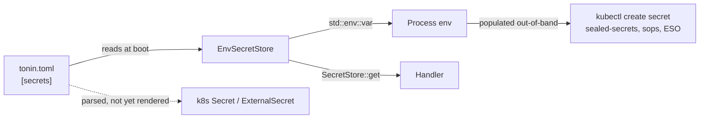

# Secrets

Read secrets by name from a backend chosen in `tonin.toml`. No SDK in your handler.

## What you get

- **A single read API** — `SecretStore::get("MY_KEY").await?` returns the value, regardless of provider.
- **Env-backed default.** The shipped `EnvSecretStore` reads `std::env::var(key)` — no network round-trip, no sidecar.
- **A declared inventory of required keys.** `[secrets].required = [...]` in `tonin.toml` names what the service needs at runtime. Today it's documentation that travels with the service; secret-manifest rendering arrives in 0.2 (see Status).
- **Hot-path safe trait.** Future cloud-backed impls cache and refresh in the background; `get()` is never expected to hit the provider per call.

## Trait surface

From `crates/tonin-core/src/traits/secret_store.rs`:

```rust
#[async_trait]
pub trait SecretStore: Send + Sync + 'static {
    /// Resolve a secret by key. Hot-path safe — impls cache and refresh
    /// in the background.
    async fn get(&self, key: &str) -> Result<String, Error>;

    /// Span attribute `secret.provider`.
    /// `"k8s" | "vault" | "external-secrets" | "aws-secrets-manager"`.
    fn provider(&self) -> &'static str;
}
```

The default impl is `EnvSecretStore`, which reads from process env and reports `provider = "k8s"` — because in production the env vars come from a k8s `Secret` mounted via `envFrom`.

## Selecting a provider

`tonin.toml`:

```toml
[secrets]
provider = "k8s"          # default; reads from env vars k8s populated from a Secret
# provider = "external-secrets"   # parsed today; renderer support 0.2+
# provider = "vault"              # parsed today; provider impl 0.2+
# provider = "aws-secrets-manager"

# Declare which secret keys this service needs at runtime.
required = ["STRIPE_API_KEY", "DATABASE_PASSWORD", "JWT_SIGNING_KEY"]

# Optional: env-var → secret-key remap when the env var name your service
# reads differs from the secret key name.
map = { STRIPE_KEY = "STRIPE_API_KEY" }

# Optional: point at an External Secrets Operator store.
# `kind` is the ESO resource kind ("ClusterSecretStore" or "SecretStore").
# external_store = { name = "aws-secrets-manager", kind = "ClusterSecretStore" }
```

## Using it

```rust
use std::sync::Arc;
use tonin::core::traits::SecretStore;
use tonin::core::state::EnvSecretStore;

async fn charge(
    secrets: Arc<dyn SecretStore>,
    req: ChargeRequest,
) -> Result<ChargeResponse, tonin::Error> {
    let stripe_key = secrets.get("STRIPE_API_KEY").await?;
    let _client = stripe::Client::new(stripe_key);
    // ...
    # Ok(ChargeResponse::default())
}

# struct ChargeRequest;
# #[derive(Default)] struct ChargeResponse;
```

In 0.1 the framework does not auto-wire `Arc<dyn SecretStore>` onto the
`Service` builder — assemble your own handler-state struct holding
`Arc<dyn SecretStore>` (typically `Arc::new(EnvSecretStore::default())`)
and hand it to your tonic-generated server. Swapping `provider = "k8s"`
to `provider = "vault"` later remains a TOML change plus a `Cargo.toml`
dep flip for the new impl crate — the handler code does not change.

## Under the hood



The dashed arrow is the 0.2 deliverable: today the renderer parses
`[secrets]` but does not emit secret manifests from it. The only
secret the renderer ships in 0.1 is the database-credentials `Secret`
(`db-secret.yaml`), populated from `[database]`.

## Status (0.1)

- **Ships now**
  - `SecretStore` trait + `EnvSecretStore` default in `tonin-core`.
  - `Instrumented<SecretStore>` decorator that wraps `get` in a `secret.get` span tagged with `secret.provider` (the key name is never recorded).
  - `[secrets]` block in `tonin.toml` is parsed into a typed `SecretsSpec` (`provider`, `required`, `map`, `external_store`) by the CLI codegen.
  - `db-secret.yaml` is rendered for `[database]` (independent of `[secrets]`).
- **Not yet in 0.1**
  - The k8s renderer does NOT emit a `Secret` resource keyed off `[secrets].required` — you create it yourself out-of-band (`kubectl create secret`, sealed-secrets, sops, CI).
  - No `envFrom: secretRef` is appended to the Deployment from `[secrets].required` (only `db-secret.yaml` is referenced today).
  - `provider = "external-secrets"` / `"vault"` / `"aws-secrets-manager"` parse, but no concrete impl crates ship, and `external_store` is not yet read by the renderer to emit an `ExternalSecret` CR.
  - No `Service::with_secrets` / `Service::secret_store()` accessor — wire `Arc<dyn SecretStore>` into your own state struct.
- **0.2 plan** — renderer consumes `[secrets].required` + `external_store` to emit a `Secret` or `ExternalSecret`; concrete impl crates `tonin-vault`, `tonin-aws-secrets`; `Service` accessor for the configured store.

## Extension point

Implement `SecretStore` against any backend. The trait is two methods and dyn-safe; wrap your impl in `Arc<dyn SecretStore>` and feed it to your handler state. To get the same telemetry the shipped default gets, wrap it once more in `Instrumented::with_defaults(...)` from `crates/tonin-core/src/instrumented.rs` — that's where the `secret.get` span comes from.

## See also

- [01-principles.md](01-principles.md) — interface-first capabilities
- [12-kubernetes-deploy.md](12-kubernetes-deploy.md) — how `tonin.toml` becomes manifests
- [05-telemetry.md](05-telemetry.md) — what the `Instrumented<T>` decorator emits
