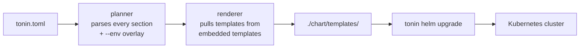

# Kubernetes deploy

One `tonin.toml` renders every manifest your service needs to ship.

## What you get

- **Every manifest a real service needs**, generated from a single TOML file:
  - `Deployment`, `Service`, `HorizontalPodAutoscaler`
  - `Ingress` when you ask for one
  - A Postgres `StatefulSet` + headless `Service` + credentials `Secret` when `[database]` is set
  - A Redis `StatefulSet` + `Service` when `[cache]` is set
  - Mesh-specific overlays (Cilium `CiliumNetworkPolicy`, Istio `PeerAuthentication`, Linkerd annotations) when `[deploy].mesh` is set
- **`tonin helm generate`** writes them as a complete Helm chart inside the `./chart/` directory. **`tonin helm upgrade`** ships them. No hand-edited YAML, ever — the next `generate` would overwrite it.
- **Multi-env overlays.** The same `tonin.toml` describes `dev`, `staging`, and `prod` — `--env` picks the right block.
- **Workspace mode.** One command walks every `tonin.toml` under a directory and renders the cross-service dependency graph.

## Complete `tonin.toml` example

Everything below comes from one file. The CLI parses it once and decides which templates to render.

```toml
[service]
name = "greeter"
version = "0.1.0"

[deploy]
replicas = 2
mesh = "cilium"
namespace = "default"
mcp_sidecar = true

[resources]
cpu = "100m"
memory = "128Mi"

[database]
engine = "postgres"
size = "10Gi"

[cache]
engine = "redis"
```

That's the whole input. `tonin helm generate` turns it into a structured Helm chart with generic template files and configuration values.

By default, `tonin helm generate` uses `micro/<name>:<version>` as the container image. Override this with `[image].registry`:

```toml
[image]
registry = "ghcr.io/myorg"   # → ghcr.io/myorg/greeter:0.1.0
```

Priority (highest to lowest):
1. `TONIN_IMAGE_PREFIX` environment variable — always wins, for CI/CD per-build overrides
2. `[image].registry` in `tonin.toml` — the default for this service
3. `micro/` prefix — built-in fallback when neither is set

Declare pod and container security context natively in `tonin.toml`. When present, `tonin helm generate` emits `podSecurityContext` and `containerSecurityContext` blocks in `values.yaml` and wires them into the Deployment. When absent, no security context fields are generated — fully backward compatible.

Keys may be written in `snake_case` (auto-converted to `camelCase`) or already in `camelCase` — both work:

```toml
# Distroless / nonroot image — full security lockdown
[security.pod]
run_as_non_root = true   # → runAsNonRoot
run_as_user     = 65532  # → runAsUser  (nonroot UID used by distroless images)
run_as_group    = 65532  # → runAsGroup
fs_group        = 65532  # → fsGroup

[security.container]
allow_privilege_escalation = false   # → allowPrivilegeEscalation
read_only_root_filesystem  = true    # → readOnlyRootFilesystem

# Nested TOML tables map to nested YAML — no special syntax needed
[security.container.capabilities]
drop = ["ALL"]

[security.container.seccomp_profile]
type = "RuntimeDefault"
```

Both `[security.pod]` and `[security.container]` are optional independently — you can declare only one. Any field supported by the Kubernetes API can be used directly; new Kubernetes security context fields work without a tonin update.

## What gets rendered

The renderer (`crates/tonin/src/codegen/render.rs`) maps `tonin.toml` fields to a fixed set of output files:

| File | When |
|---|---|
| `deployment.yaml` | always |
| `service.yaml` | always |
| `hpa.yaml` | always (CPU-based; a `[deploy].hpa = false` opt-out is roadmapped, not yet implemented) |
| `ingress.yaml` | `[deploy].expose = "ingress"` |
| `db-secret.yaml` | `[database]` present (shared **or** owned — the Deployment's `envFrom` needs it either way) |
| `db-statefulset.yaml` | `[database]` present and `shared = false` |
| `db-service.yaml` | `[database]` present and `shared = false` |
| `cache-statefulset.yaml` | `[cache]` present and `shared = false` |
| `cache-service.yaml` | `[cache]` present and `shared = false` |
| `mesh/<engine>/*.yaml` | `[deploy].mesh = "cilium" \| "istio" \| "linkerd"` |

`shared = true` on `[database]` or `[cache]` means a backing store already exists in the cluster — the framework wires the env vars (`DATABASE_URL`, `REDIS_URL`) but skips the StatefulSet.

## Service protocol: gRPC, HTTP, or both

`[service].type` selects the primary protocol. It defaults to `backend` (gRPC), so existing services are unaffected.

| `type` | Port | Probe | Notes |
|---|---|---|---|
| `backend` (default) | gRPC `50051` | none | unchanged; MCP sidecar per `[deploy].mcp_sidecar` |
| `http` | `8080` (or `[service].port`) | `httpGet /health` | plain HTTP/REST service (e.g. axum); MCP sidecar forced off |
| `web` | `8080`/`3000` by `web_mode` | none | TypeScript SPA/BFF frontend |

`[service].port` overrides the listen port for any type. An `http` service gets a default `GET /health` liveness/readiness probe; customize it with `[service.health]`:

```toml
[service]
name = "web-api"
version = "0.1.0"
type = "http"
port = 7001

[service.health]
path = "/healthz"   # default: /health
# port = 7001       # default: the service's listen port
```

**Both gRPC and HTTP.** A gRPC `backend` can *also* expose an HTTP port (health, metrics, admin) — the two are not exclusive. Add `[service.http]`:

```toml
[service]
name = "collector"
version = "0.1.0"        # type defaults to backend (gRPC on 50051)

[service.http]
port = 8081              # extra HTTP port, rendered alongside grpc
health_path = "/health" # optional httpGet probe on :8081
```

This renders a Service with both `grpc` and `http` ports, a Deployment with both container ports plus the HTTP probe, and (under Cilium) caller ingress rules for both.

`tonin helm generate` is offline — it only writes Helm templates. Anything that talks to a cluster (`diff`, `upgrade`, `uninstall`) needs a reachable Kubernetes API. There is no embedded cluster; bring your own.

**On a dev machine,** any of the following works:

| Option | Notes |
|---|---|
| [Rancher Desktop](https://rancherdesktop.io) | Recommended. Ships containerd, k3s, and a working kubeconfig out of the box. Mesh-compatible. |
| [OrbStack](https://orbstack.dev) (macOS) | Lightweight; enable Kubernetes mode in settings. |
| Docker Desktop | Enable Kubernetes in settings. Heavier than the above. |
| [kind](https://kind.sigs.k8s.io) | `kind create cluster` — fastest for CI / scripted setup. |
| [k3d](https://k3d.io) | `k3d cluster create` — k3s in Docker; good for multi-node testing. |
| [minikube](https://minikube.sigs.k8s.io) | Mature; many drivers. |

Sanity check after install:

```bash
kubectl version --short    # both Client and Server should print
kubectl get nodes          # at least one Ready node
```

**For a real deployment**, any conformant managed Kubernetes works: GKE,
EKS, AKS, DOKS, Civo, Linode LKE, or self-managed (RKE2, Talos, kubeadm,
OpenShift). The framework doesn't depend on cloud-provider-specific
extensions.

**Mesh install runs separately.** If `[deploy].mesh` is set to anything
other than `none`, install the mesh on the cluster *before* `tonin k8s
apply`:

```bash
cilium install                   # Cilium
linkerd install | kubectl apply -f -    # Linkerd
istioctl install --set profile=demo     # Istio
```

`tonin helm upgrade` will succeed without the mesh installed, but the
mesh-specific overlays (CiliumNetworkPolicy, PeerAuthentication, etc.)
will sit dormant until the mesh CRDs exist.

## Commands

```bash
# Render Helm chart to ./chart/
tonin helm generate

# Render templates locally to stdout (dry-run)
tonin helm template

# Show the diff vs. what's currently deployed (requires helm-diff plugin)
tonin helm diff --env prod

# Deploy to the cluster (helm upgrade --install)
tonin helm upgrade --env prod

# Pick the [database.staging] / [cache.staging] overlay during chart generation
tonin helm generate --env staging
```

## Multi-env overlays

The base block is the default. Nested `[<section>.<env>]` blocks override fields per environment without duplicating the rest:

```toml
[database]
engine = "postgres"

[database.staging]
size = "5Gi"

[database.prod]
size = "100Gi"
```

```bash
tonin helm generate --env prod      # renders with size = "100Gi"
tonin helm generate --env staging   # renders with size = "5Gi"
tonin helm generate                 # uses TONIN_ENV, then defaults to dev
```

The same pattern works for `[cache.<env>]`, and for any field that differs between environments (replicas, resources, mesh choice).

### Per-environment namespaces and dependencies

Namespaces in `[deploy]` and `[depends_on]` resolve per environment. The
`{env}` placeholder is substituted with the environment being rendered, so a
single declaration covers every environment:

```toml
[deploy]
namespace = "myapp-{env}"          # → myapp-dev / myapp-staging / myapp-prod

[depends_on]
users-service     = "myapp-{env}"      # egress target follows the same convention
inventory-service = "inventory-{env}"
```

When a dependency doesn't follow the `<base>-<env>` convention, use the table
form — a shorthand string *or* a table is accepted per entry (the same
ergonomics as a `Cargo.toml` dependency):

```toml
[depends_on]
users-service     = "myapp-{env}"                                                          # shorthand
inventory-service = { namespace = "inventory-{env}", prod = "inventory-shared" }           # prod overrides the convention
audit-sink        = { namespace = "security-{env}", envs = ["prod"] }                      # only egresses in prod
billing           = { namespace = "@inherit" }                                             # namespace set at deploy time; omitted from the chart
```

Resolution rules for an environment `E`:

- A per-env override key (`prod = "..."`) wins over the default `namespace`.
- `envs = [...]` restricts the dependency to those environments; elsewhere it is dropped.
- `@inherit` omits the entry from the rendered policy — supply it at deploy time (`--set-json`) or via GitOps.
- If an active dependency has no namespace for `E`, or a `{...}` placeholder is left unresolved, generation **fails** — there is no silent fallback to a base value, which is what previously let a dev namespace leak into a prod chart.

Both the shorthand string form and literal namespaces (no `{env}`) keep working unchanged.

## How it fits together



The planner is the only thing that decides *what* gets rendered. The templates decide *how*. Add a field to `tonin.toml`, plumb it through the planner, and every service inherits it on the next `generate`.

## See also

- [01-principles.md](01-principles.md) — why `tonin.toml` is the single source of truth
- [13-service-mesh.md](13-service-mesh.md) — the mesh overlays rendered under `mesh/<engine>/`
- [08-database.md](08-database.md) — what `[database]` configures at runtime
- [07-cache.md](07-cache.md) — what `[cache]` configures at runtime

Full reference: [examples/greeter](https://github.com/Rushit/tonin/tree/main/examples/greeter).
