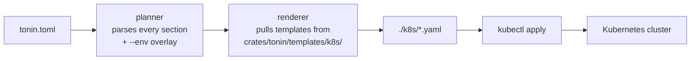

# Kubernetes deploy

One `tonin.toml` renders every manifest your service needs to ship.

## What you get

- **Every manifest a real service needs**, generated from a single TOML file:
  - `Deployment`, `Service`, `HorizontalPodAutoscaler`
  - `Ingress` when you ask for one
  - A Postgres `StatefulSet` + headless `Service` + credentials `Secret` when `[database]` is set
  - A Redis `StatefulSet` + `Service` when `[cache]` is set
  - Mesh-specific overlays (Cilium `CiliumNetworkPolicy`, Istio `PeerAuthentication`, Linkerd annotations) when `[deploy].mesh` is set
- **`tonin k8s generate`** writes them to `./k8s/`. **`tonin k8s apply`** ships them. No hand-edited YAML, ever — the next `generate` would overwrite it.
- **Multi-env overlays.** The same `tonin.toml` describes `dev`, `staging`, and `prod` — `--env` picks the right block.
- **Workspace mode.** One command walks every `tonin.toml` under a directory and renders the cross-service dependency graph.

## Complete `tonin.toml` example

Everything below comes from one file. The CLI parses it once and decides which templates to render.

```toml
[service]
name = "greeter"
version = "0.1.0"

[deploy]
replicas = 2
mesh = "cilium"
namespace = "default"
mcp_sidecar = true

[resources]
cpu = "100m"
memory = "128Mi"

[database]
engine = "postgres"
size = "10Gi"

[cache]
engine = "redis"
```

That's the whole input. `tonin k8s generate` turns it into roughly a dozen YAML files.

## What gets rendered

The renderer (`crates/tonin/src/codegen/render.rs`) maps `tonin.toml` fields to a fixed set of output files:

| File | When |
|---|---|
| `deployment.yaml` | always |
| `service.yaml` | always |
| `hpa.yaml` | always (CPU-based; a `[deploy].hpa = false` opt-out is roadmapped, not yet implemented) |
| `ingress.yaml` | `[deploy].expose = "ingress"` |
| `db-secret.yaml` | `[database]` present (shared **or** owned — the Deployment's `envFrom` needs it either way) |
| `db-statefulset.yaml` | `[database]` present and `shared = false` |
| `db-service.yaml` | `[database]` present and `shared = false` |
| `cache-statefulset.yaml` | `[cache]` present and `shared = false` |
| `cache-service.yaml` | `[cache]` present and `shared = false` |
| `mesh/<engine>/*.yaml` | `[deploy].mesh = "cilium" \| "istio" \| "linkerd"` |

`shared = true` on `[database]` or `[cache]` means a backing store already exists in the cluster — the framework wires the env vars (`DATABASE_URL`, `REDIS_URL`) but skips the StatefulSet.

## Local cluster setup

`tonin k8s generate` is offline — it only writes YAML. Anything that talks
to a cluster (`validate`, `diff`, `apply`, `setup`) needs a reachable
Kubernetes API. There is no embedded cluster; bring your own.

**On a dev machine,** any of the following works:

| Option | Notes |
|---|---|
| [Rancher Desktop](https://rancherdesktop.io) | Recommended. Ships containerd, k3s, and a working kubeconfig out of the box. Mesh-compatible. |
| [OrbStack](https://orbstack.dev) (macOS) | Lightweight; enable Kubernetes mode in settings. |
| Docker Desktop | Enable Kubernetes in settings. Heavier than the above. |
| [kind](https://kind.sigs.k8s.io) | `kind create cluster` — fastest for CI / scripted setup. |
| [k3d](https://k3d.io) | `k3d cluster create` — k3s in Docker; good for multi-node testing. |
| [minikube](https://minikube.sigs.k8s.io) | Mature; many drivers. |

Sanity check after install:

```bash
kubectl version --short    # both Client and Server should print
kubectl get nodes          # at least one Ready node
```

**For a real deployment**, any conformant managed Kubernetes works: GKE,
EKS, AKS, DOKS, Civo, Linode LKE, or self-managed (RKE2, Talos, kubeadm,
OpenShift). The framework doesn't depend on cloud-provider-specific
extensions.

**Mesh install runs separately.** If `[deploy].mesh` is set to anything
other than `none`, install the mesh on the cluster *before* `tonin k8s
apply`:

```bash
cilium install                   # Cilium
linkerd install | kubectl apply -f -    # Linkerd
istioctl install --set profile=demo     # Istio
```

`tonin k8s apply` will succeed without the mesh installed, but the
mesh-specific overlays (CiliumNetworkPolicy, PeerAuthentication, etc.)
will sit dormant until the mesh CRDs exist.

## Commands

```bash
# Render to ./k8s/
tonin k8s generate

# Server-side dry-run against the live cluster
tonin k8s validate

# Show the diff vs. what's currently applied
tonin k8s diff

# Render and kubectl apply
tonin k8s apply

# Render every tonin.toml under the current dir, apply them all
tonin k8s apply --workspace

# Pick the [database.staging] / [cache.staging] overlay
tonin k8s generate --env staging

# Print to stdout instead of writing files
tonin k8s generate --dry-run
```

`--workspace` walks the tree, finds every `tonin.toml`, and builds the cross-service `depends_on` graph so generated network policies cover the real call paths.

## Multi-env overlays

The base block is the default. Nested `[<section>.<env>]` blocks override fields per environment without duplicating the rest:

```toml
[database]
engine = "postgres"

[database.staging]
size = "5Gi"

[database.prod]
size = "100Gi"
```

```bash
tonin k8s generate --env prod      # renders with size = "100Gi"
tonin k8s generate --env staging   # renders with size = "5Gi"
tonin k8s generate                 # uses TONIN_ENV, then defaults to dev
```

The same pattern works for `[cache.<env>]`, and for any field that differs between environments (replicas, resources, mesh choice).

## How it fits together



The planner is the only thing that decides *what* gets rendered. The templates decide *how*. Add a field to `tonin.toml`, plumb it through the planner, and every service inherits it on the next `generate`.

## See also

- [01-principles.md](01-principles.md) — why `tonin.toml` is the single source of truth
- [13-service-mesh.md](13-service-mesh.md) — the mesh overlays rendered under `mesh/<engine>/`
- [08-database.md](08-database.md) — what `[database]` configures at runtime
- [07-cache.md](07-cache.md) — what `[cache]` configures at runtime

Full reference: [examples/greeter](https://github.com/Rushit/tonin/tree/main/examples/greeter).
