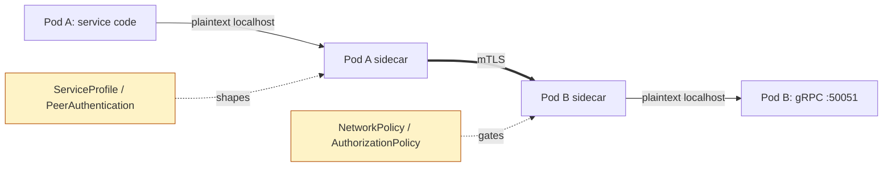

# Service mesh integration

Let the network layer handle the network, so your service binary stays small.

## What the mesh does for you (so we don't)

A service mesh sits next to every pod and intercepts the network. tonin leans on it instead of reimplementing the same concerns inside the framework. You gain:

- **mTLS between pods** — every hop is encrypted and peer-identified, with no `rustls` config, no cert files, and no in-process rotation logic in your binary.
- **Retries and timeouts** — declared once at the mesh, applied uniformly to every service, in every language.
- **Circuit breaking and outlier detection** — unhealthy upstreams get ejected by the sidecar, not by code you have to ship.
- **Traffic shifting** — canaries, blue/green, and header-based routing become a `VirtualService` or `HTTPRoute`, not a feature flag in your handler.
- **Multi-cluster routing** — `<svc>.<ns>.svc.cluster.local` keeps working across cluster boundaries (see [11-service-discovery.md](11-service-discovery.md)).
- **Uniform observability** — golden-signal dashboards (latency / error / saturation) come from the mesh control plane and look the same for every service.

The developer upside is concrete: smaller binaries, fewer dependencies to audit, no cert-rotation surprises at 3am, and the same mesh dashboard whether the service is Rust, Python, or TypeScript.

## Choosing a mesh

Set the mesh in `tonin.toml`:

```toml
[deploy]
mesh = "cilium"   # "cilium" | "istio" | "linkerd" | "none"
```

Default is `"cilium"` — both the `Mesh` enum's `#[default]` and the scaffold `tonin service new` lands. Set `mesh = "none"` explicitly to run on bare Kubernetes with no mesh overlays. Picking a mesh tells the CLI to render the right overlays alongside the base `Deployment` / `Service` manifests.

Adding a new mesh today is a code change, not a pure template drop — the `Mesh` enum in `crates/tonin/src/codegen/plan.rs` is closed (`Cilium | Istio | Linkerd | None`), and serde rejects unknown values. A new mesh requires (1) a new enum variant + parse mapping in `plan.rs` and (2) a sibling directory under `crates/tonin/templates/k8s/mesh/<name>/`. PRs welcome — see [CONTRIBUTING.md](../CONTRIBUTING.md).

## What gets rendered per mesh

`tonin k8s generate` emits a base set of manifests plus mesh-specific overlays. The mesh overlays live under `crates/tonin/templates/k8s/mesh/<engine>/` and produce one YAML file each in the rendered output.

### `mesh = "cilium"`

- `networkpolicy.yaml` — `CiliumNetworkPolicy` restricting ingress to the service's gRPC port from labelled callers.
- `pod-annotations.yaml` — pod-spec patch adding Cilium-specific labels and identity annotations.

### `mesh = "istio"`

- `authorizationpolicy.yaml` — `AuthorizationPolicy` allowing only declared callers (by service account) to reach the gRPC port.
- `peerauthentication.yaml` — `PeerAuthentication` forcing `STRICT` mTLS for the workload.
- `pod-annotations.yaml` — sidecar-injection and proxy-config annotations.

### `mesh = "linkerd"`

- `serviceprofile.yaml` — `ServiceProfile` describing the gRPC routes for retry budgets and per-route metrics.
- `authorizationpolicy.yaml` — `AuthorizationPolicy` + `MeshTLSAuthentication` gating the gRPC port to identified peers.
- `pod-annotations.yaml` — `linkerd.io/inject: enabled` and friends.

### `mesh = "none"`

- `pod-annotations.yaml` — empty placeholder, kept so downstream tooling can patch annotations without a conditional.

You do not hand-edit these files. They are re-rendered from `tonin.toml` every time you run `tonin k8s generate`. See [12-kubernetes-deploy.md](12-kubernetes-deploy.md) for the full render pipeline.

## Mesh dependencies

Install the mesh once per cluster, before deploying any service that selects it. Upstream docs are the source of truth:

- **Cilium** — https://docs.cilium.io/en/stable/installation/
- **Istio** — https://istio.io/latest/docs/setup/install/
- **Linkerd** — https://linkerd.io/2/getting-started/

The CLI does not install the mesh for you; it assumes the CRDs (`CiliumNetworkPolicy`, `AuthorizationPolicy`, `ServiceProfile`, …) are already registered in the target cluster.

## Cross-cluster

Both Linkerd (multi-cluster gateways) and Istio (multi-mesh / multi-primary) make `<svc>.<ns>.svc.cluster.local` resolve transparently across cluster boundaries. Cilium Cluster Mesh provides the same property at the network layer. Your service code stays the same:

```rust
let resp = greeter_client::GreeterClient::connect(
    "http://greeter.prod.svc.cluster.local:50051"
).await?;
```

The mesh routes the call to the closest healthy backend, whether that's in-cluster or in a peer cluster. See [11-service-discovery.md](11-service-discovery.md) for how DNS resolution works in tonin and why no client-side load balancer is needed.

## How a call flows through the mesh



Your code talks plaintext to `localhost`. The sidecar terminates and originates mTLS. Policy CRDs (rendered by `tonin k8s generate`) decide who can talk to whom and how retries are budgeted.

## Why mTLS is NOT in the framework

The framework deliberately does not ship a TLS stack, a cert loader, or a rotation loop. Network identity, encryption, and policy belong at the network layer — see [01-principles.md](01-principles.md) under "mesh-delegated network concerns". Putting cert rotation in every service binary would mean:

- Each language runtime carrying its own TLS config and bug surface.
- A second source of truth (in-code policy) competing with the mesh's policy CRDs.
- Cert rotation problems showing up as application-level errors instead of platform-level ones.

By leaving mTLS to the mesh, the same identity model applies uniformly to Rust, Python, and TypeScript services, and rotation is an operational concern, not a release concern.

## See also

- [01-principles.md](01-principles.md) — mesh-delegated network concerns
- [11-service-discovery.md](11-service-discovery.md) — DNS-based service resolution (including cross-cluster)
- [12-kubernetes-deploy.md](12-kubernetes-deploy.md) — how manifests get rendered from `tonin.toml`
