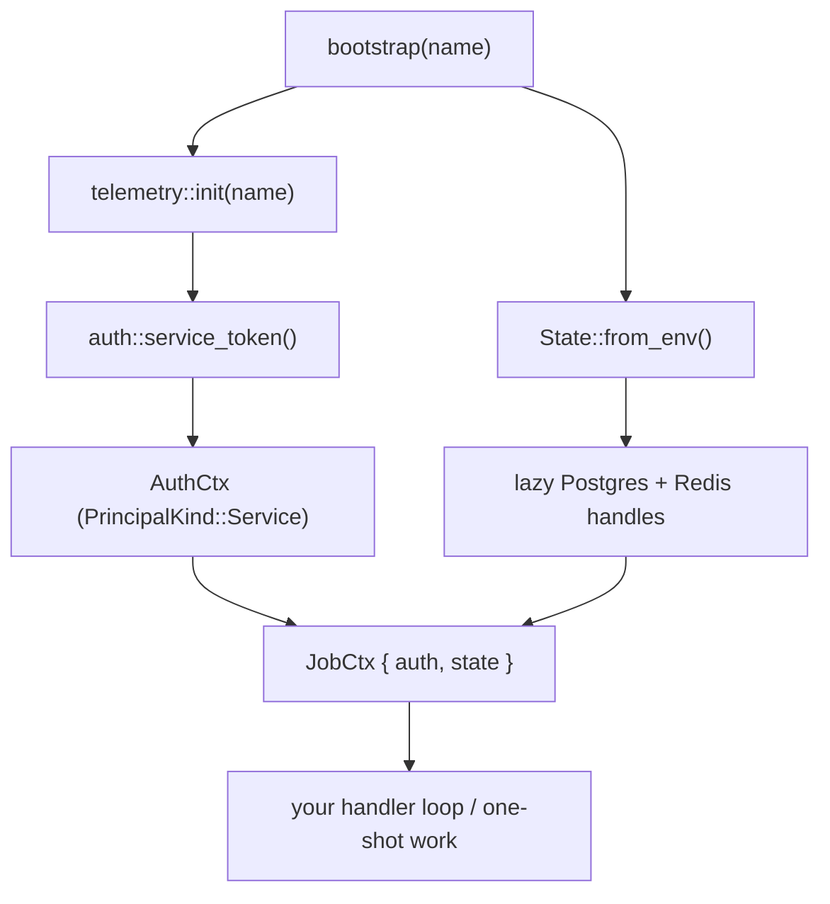

# Background jobs

Run code that isn't a gRPC server — with the same telemetry, identity, and capability handles as a server would have.

## What you get

A binary entry point that boots the framework *without* binding a port. Use it for:

- queue / event-bus consumers (long-running)
- scheduled tasks (cron-style, one shot per invocation)
- one-shot migrations or backfills
- reconciliation loops

What `bootstrap` wires for you:

- OTel exporters initialized (same collector as your gRPC server — spans land alongside server spans)
- A service-identity `AuthCtx` minted for *this* binary, ready to propagate on outbound calls
- A shared `State` with Postgres + Redis handles resolved lazily from env (`DATABASE_URL`, `REDIS_URL`)

No port bound, no inbound auth layer, no gRPC routing. Just a process that knows who it is and how to talk to its dependencies.

## Bootstrap

```rust
use tonin::prelude::*;

#[tokio::main]
async fn main() -> Result<()> {
    let ctx = tonin::job::bootstrap("orders-reconcile").await?;

    tracing::info!(
        subject = %ctx.auth.subject,
        has_pg = ctx.state.has_pg(),
        "reconcile starting",
    );

    // ... consumer loop or one-shot work ...
    // ctx.state.pg() / ctx.state.redis() for queries
    // ctx.auth.propagate(&mut req) on outbound RPCs

    Ok(())
}
```

`bootstrap` returns a `JobCtx { auth, state }`. Both fields are cheap to clone, so passing the context into spawned tasks is fine — but see the spawn pitfall below.

## Service identity

A gRPC handler extracts `AuthCtx` from the inbound request's `Authorization` header. A job has **no inbound request**, so the framework mints an `AuthCtx` representing the local service itself (`PrincipalKind::Service`, subject = the configured service name).

The job then propagates that identity on outbound gRPC calls:

```rust
let mut req = tonic::Request::new(MyRequest { /* ... */ });
ctx.auth.propagate(&mut req);
client.do_thing(req).await?;
```

The callee sees the call as coming from a known service principal, not anonymous. This is how peer-to-peer authorization works inside the cluster without a user being in the loop. See [06-authentication.md](06-authentication.md) for how `AuthCtx`, `service_token`, and the auth layer fit together.

### Spawn pitfall

The `CURRENT_AUTH` task-local that the server's auth layer normally populates is **not** set inside a job — there's no incoming request to set it from. If you `tokio::spawn` work that needs the auth context, capture it before the spawn:

```rust
let auth = ctx.auth.clone();
tokio::spawn(async move {
    let mut req = tonic::Request::new(/* ... */);
    auth.propagate(&mut req);
    // ...
});
```

## Scaffolding

```bash
tonin service new orders --with-job reconcile
```

This generates the usual gRPC server scaffold plus `src/bin/orders-reconcile.rs` with the bootstrap call ready-wired. The binary name is `<service>-<jobname>` so each job is unambiguous when several services in a workspace each ship their own. Build it the same as any Cargo binary:

```bash
cargo build --release --bin orders-reconcile
```

Job scaffolding works for **Rust and Python** today (Python lands the equivalent under `server/src/<svc>_server/jobs/<name>.py` and wires `[project.scripts]`). TypeScript scaffolds expose only the gRPC / web server shape — no job entry point yet.

## Running in Kubernetes

Today, jobs are plain binaries. Ship the same container image as your gRPC server (the Dockerfile builds all binaries in the crate) and run the job as one of:

- a separate `Deployment` with `command: ["orders-reconcile"]` for long-running consumers
- a one-shot `Job` for migrations
- a hand-written `CronJob` for scheduled work

Roadmap: a `[[jobs]]` block in `tonin.toml` will let the CLI render a `CronJob` per declared job from the same template tree it uses for `Deployment`. Not in 0.1.

## EventBus consumer pattern

The canonical use of `bootstrap` is an event-bus consumer that subscribes, processes, and acks. The bus drives the loop; the job just holds the connection and the identity.

See [09-event-bus.md](09-event-bus.md) for the `EventBus` trait, ack / nack semantics, and the at-least-once delivery contract. The bus handle hangs off `ctx.state` once the `[eventbus]` capability is wired (also roadmapped — see [09-event-bus.md](09-event-bus.md) for current status).

## Under the hood



Telemetry failure is non-fatal (the job runs without exporters, same posture as the server). Service-token mint failure and unreachable Postgres / Redis (when the env vars are set) are fatal — these are deploy-time misconfigurations and the right response is to fail at bootstrap rather than crash mid-loop.

## Status (0.1)

- `tonin::job::bootstrap` ships and works
- `tonin service new --with-job <name>` scaffolds a Rust binary
- `[[jobs]]` config block + `CronJob` rendering: **deferred** to a later release; today, run jobs as a separate Deployment or hand-written CronJob.

## See also

- [05-telemetry.md](05-telemetry.md) — what `telemetry::init` wires up
- [06-authentication.md](06-authentication.md) — `AuthCtx`, `service_token`, propagation
- [09-event-bus.md](09-event-bus.md) — the most common job shape: a bus consumer

Full reference: [examples/greeter](https://github.com/Rushit/tonin/tree/main/examples/greeter).
