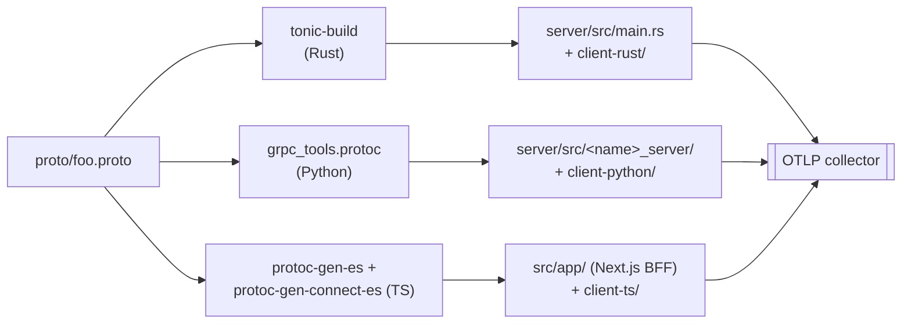

# Multi-language services

One `.proto`, one `tonin.toml`, multiple runtimes — same wire, same observability.

## What you get

- **One source of truth.** A single `proto/<svc>.proto` defines the wire contract; the CLI scaffolds a server in your chosen language and (optionally) clients in others.
- **One `tonin.toml`.** Service name, replicas, mesh, MCP sidecar, namespace — declared once, regardless of language.
- **Same wire, same mesh.** Rust, Python, and TypeScript services are interchangeable peers behind the same Cilium / Istio / Linkerd sidecar. mTLS, retries, and routing are mesh-delegated (see [13-service-mesh.md](13-service-mesh.md)) — they work uniformly across languages.
- **Same observability target.** Span names, attribute keys, and W3C TraceContext propagation are defined by `tonin-core`. Future `tonin-py` and `tonin-ts` runtimes will target the same OTel output, so a trace can hop Rust → Python → TS and stay coherent in the collector.
- **Polyglot client SDKs from one CLI flag.** A Rust server can ship Rust, Python, and TypeScript clients side-by-side in the same repo.

## Scaffolding a Python service

```bash
tonin service new orders --lang python
```

The scaffold lays down:

```
orders/
  tonin.toml
  proto/orders.proto
  Dockerfile
  server/
    pyproject.toml              # [project.scripts] orders = "orders_server.main:run"
    codegen.sh                  # python -m grpc_tools.protoc ...
    src/orders_server/
      __init__.py
      main.py                   # async grpc.aio entry point
      handler.py                # service impl
      auth.py                   # AuthCtx-equivalent verifier
```

`tonin.toml` carries `[service].language = "python"`, which tells the CLI to skip cargo and use the Python Dockerfile path. Codegen is a thin shell wrapper around `grpc_tools.protoc` — run it once after editing the proto.

```bash
cd orders/server
bash codegen.sh
python -m orders_server.main
# or, via the [project.scripts] entry point:
orders
```

The server listens on `:50051` (plaintext); the mesh sidecar handles mTLS. The scaffold leaves OTel wiring to you — point the upstream OpenTelemetry Python SDK at the same `OTEL_EXPORTER_OTLP_ENDPOINT` Rust services use (see [05-telemetry.md](05-telemetry.md)). A language-native `tonin-py` runtime that mirrors the Rust `Service::new(...).run()` shape is on the roadmap; today the scaffold's `main.py` imports a `tonin` package that does not yet exist on PyPI — you either bootstrap one in-tree or strip the import and wire grpc.aio directly until the runtime crate lands.

## Scaffolding a TypeScript BFF

```bash
tonin service new bff --lang ts --type web --web-mode bff
```

You get a Next.js Backend-for-Frontend wired for [Connect-ES](https://connectrpc.com/docs/web/getting-started):

```
bff/
  tonin.toml
  package.json
  buf.gen.yaml                  # connectrpc-es codegen config
  src/
    app/                        # Next.js app router
    gen/                        # generated *_pb.ts, *_connect.ts
  Dockerfile
```

`buf.gen.yaml` points at the upstream proto directory and runs `protoc-gen-es` + `protoc-gen-connect-es`. Generate stubs with `buf generate`; the Next.js server-side handlers import from `src/gen/` and call upstream gRPC services through the mesh.

For a pure browser SPA instead, use `--web-mode spa`: Vite + React, no server, no MCP sidecar, served by nginx.

## Client SDKs for any service

A single CLI flag emits extra clients alongside the server. The server's native client (matching `--lang`) is always emitted; `--client-lang` adds more:

```bash
# Rust server, plus Python and TS client packages
tonin service new greeter --lang rust --client-lang python --client-lang ts
```

Result:

```
greeter/
  proto/                        # shared contract
  src/                          # rust server
  client-rust/                  # native client crate
  client-python/                # pip-installable client package
  client-ts/                    # npm-installable connect-es client
```

Each client package has its own `codegen.sh` (or `buf.gen.yaml` for TS) reading the same proto. When the proto changes, regenerate everything from one place — every client in the fleet stays in lockstep.

You can also generate just the SDKs for an existing service: see [03-grpc-service.md](03-grpc-service.md) for how `tonin proto generate` rebuilds stubs in place.

## Same observability everywhere

`tonin-core` defines the observability contract that every language runtime targets:

| Concern | Contract |
|---|---|
| Span name | `<service>.<rpc>` (e.g. `greeter.SayHello`) |
| Propagation | W3C TraceContext (`traceparent`, `tracestate`) on gRPC metadata |
| Attribute keys | `rpc.system=grpc`, `rpc.method`, `service.name`, capability-specific keys (e.g. `cache.provider`) |
| Exporter | OTLP/gRPC to `OTEL_EXPORTER_OTLP_ENDPOINT` |

The Rust runtime implements this end-to-end (see [05-telemetry.md](05-telemetry.md)). Future `tonin-py` and `tonin-ts` runtimes will provide the same **observable output**, not the same API — idiomatic per language, identical in the collector.

## Status today

| Language | Server scaffold | Server runtime | Client SDK |
|---|---|---|---|
| Rust | yes | `tonin-core` (complete) | yes |
| Python | yes | plain `grpc.aio` + manual OTel wiring (no `tonin-py` crate yet) | yes |
| TypeScript (BFF) | yes (Next.js) | Next.js + Connect-ES handlers | yes (connect-es) |
| TypeScript (SPA) | yes (Vite + React) | n/a (browser app) | yes (connect-es) |

The Rust runtime is the reference. Python and TS scaffolds are real and run, but they lean on upstream gRPC / Connect-ES tooling — the framework-level Service builder, capability traits, and auto-instrumentation do not yet exist in those languages. `tonin-py` / `tonin-ts` runtime crates are on the roadmap.

## Shared client primitives (`tonin-client`)

Calling a peer service needs more than generated stubs — it needs a small,
stable set of client-side types: the auth context to propagate, retry and
circuit-breaker config, and trace/deadline header helpers. These live in a tiny
**`tonin-client`** package, one per language, that a caller depends on *without*
pulling in the server framework:

| Language | Package | Registry |
|---|---|---|
| Rust | [`crates/tonin-client`](../crates/tonin-client) | crates.io |
| Python | [`python/tonin-client`](../python/tonin-client) | PyPI |
| TypeScript | [`ts/tonin-client`](../ts/tonin-client) | npm |

All three expose the same surface — `AuthCtx` (with `propagate`), `RetryPolicy`,
`CircuitBreaker`, and `inject_traceparent` / `inject_tracestate` /
`inject_deadline` — and the **same wire shape** (snake_case JSON), so an
`AuthCtx` produced by a Rust interceptor is understood verbatim by a Python or
TypeScript caller.

The Rust types in `crates/tonin-client/src/` are the source of truth.
`cargo run --bin gen-shared-types --features cli` regenerates the Python
(`_generated.py`) and TypeScript (`_generated.ts`) mirrors; a CI drift gate
(`shared-types-drift`) fails if either is stale, and each package's own
`generated-match` test fails if a hand-written type diverges from its mirror.

Retry, caching, and circuit-breaking are *config here, execution in the
sidecar*: non-Rust callers route outbound RPCs through the per-pod
[`tonin-proxy`](../crates/tonin-proxy) sidecar (localhost, plain gRPC), which
performs the coalescing / caching / retry / breaker work across all worker
processes.

## Under the hood



One proto fans out to three codegen toolchains; all three runtimes emit OTel to the same collector with the same span / attribute contract.

## See also

- [02-architecture.md](02-architecture.md) — framework crate map and runtime layout
- [03-grpc-service.md](03-grpc-service.md) — Rust Service builder, handler shape, `tonin proto generate`
