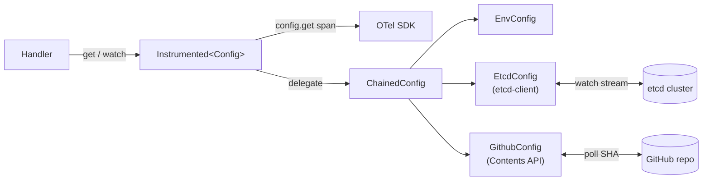

# Dynamic config

Load and hot-reload application config from any backend — env, file, etcd,
a private GitHub repo, k8s ConfigMap, or any chain of those — behind a
single trait. `[config].engine = "..."` in `tonin.toml` picks the
implementation; handler code never changes.

## What you get

- **A single `get<T>(path)` API** that returns typed config from any backend.
- **Hot reload** as a `tokio::sync::watch::Receiver`. Subscribe once; the
  channel emits the current value at subscribe time and re-emits on every
  backend-observed change.
- **Swappable engines.** `engine = "env"`, `"etcd"`, `"github"`, or
  `"chained"`. Switching is a TOML change plus a `Cargo.toml` dep flip —
  not a handler rewrite. (`docs/01-principles.md` interface-first.)
- **Composable fallback chains.** `ChainedConfig` queries sources in order;
  first non-`None` wins. Typical pattern: file overrides → env → etcd →
  bundled defaults.
- **OTel-traced.** `Instrumented<Config>` emits a `config.get` span with
  `config.source` + `config.path` attributes. Unlike `SecretStore`, paths
  ARE recorded (they describe application structure, not credentials).

## Trait

From `crates/tonin-core/src/traits/config.rs`:

```rust
#[async_trait]
pub trait Config: Send + Sync + 'static {
    async fn get(&self, path: &str) -> Result<Option<Vec<u8>>, Error>;

    fn watch(
        &self,
        path: &str,
        interval: Duration,
    ) -> tokio::sync::watch::Receiver<Option<Vec<u8>>>;

    fn source(&self) -> &'static str;
}

// Typed accessor (free function — works through `dyn Config`).
pub async fn get_typed<T: DeserializeOwned>(
    cfg: &(dyn Config + '_),
    path: &str,
) -> Result<Option<T>, Error>;
```

`watch` returns `Option<Vec<u8>>` — `Some(bytes)` for "current value" and
`None` for "absent or deleted". Polling backends honor `interval`; push
backends (etcd) ignore it and emit as soon as the backend signals.

## Engines

### `env` (default, ships in `tonin-core`)

`EnvConfig::new(prefix)` translates dotted paths into env-var names: with
`prefix = "APP_"`, the path `"db.pool.max"` looks up `APP_DB_POOL_MAX`.
No reload — env doesn't change at runtime, so `watch` emits the current
value once and nothing after.

### `etcd` (ships in `tonin-config-etcd`)

```toml
[config]
engine        = "etcd"
endpoints     = ["https://etcd.observability.svc.cluster.local:2379"]
path_prefix   = "/myservice/"
```

Backed by [`etcd-client`](https://crates.io/crates/etcd-client) v3 API.
Native server-pushed watches (no polling), TLS support for the in-cluster
etcd pattern. Configure via env at runtime:
`TONIN_CONFIG_ETCD_ENDPOINTS`, `TONIN_CONFIG_ETCD_PREFIX`,
`TONIN_CONFIG_ETCD_TLS_{CA,CERT,KEY}`, `TONIN_CONFIG_ETCD_{USER,PASSWORD}`.

A note on "etcd already in k8s": the etcd that runs inside a Kubernetes
control plane backs the kube-apiserver and **applications must not read
from it**. Run a separate etcd cluster for app config (e.g. via the
etcd-operator) or use a k8s `ConfigMap` engine instead.

### `github` (ships in `tonin-config-github`)

```toml
[config]
engine                = "github"
repo                  = "owner/private-config"
git_ref               = "main"
path_prefix           = "services/myservice/"
poll_interval_seconds = 30
```

Pulls config from a private GitHub repo via the
[Contents API](https://docs.github.com/en/rest/repos/contents). Auth via a
PAT or GitHub App installation token (env var
`TONIN_CONFIG_GITHUB_TOKEN`). Hot reload polls the head commit SHA on the
configured ref every `poll_interval_seconds`; on SHA change it re-fetches
and emits. Exponential backoff on transient HTTP failures, cap five
minutes; 401/403 stop the watcher loudly.

### `chained`

```toml
[config]
engine  = "chained"
sources = ["github", "etcd", "env"]   # first hit wins
```

Each source still needs its own block (`[config.github]`, `[config.etcd]`)
in a future revision; for now declare sources via env at runtime and
compose them in code:

```rust
use std::sync::Arc;
use tonin::core::traits::{ChainedConfig, EnvConfig, Config};

let github = Arc::new(tonin_config_github::GithubConfig::from_env()?);
let etcd   = Arc::new(tonin_config_etcd::EtcdConfig::from_env().await?);
let env    = Arc::new(EnvConfig::new("APP_"));

let cfg: Arc<dyn Config> = Arc::new(ChainedConfig::new(vec![github, etcd, env]));
```

## Using it

```rust,no_run
use std::sync::Arc;
use std::time::Duration;
use tonin::core::traits::{Config, get_typed};
use serde::Deserialize;

#[derive(Clone, Debug, Deserialize)]
struct DbPool {
    max_connections: u32,
    idle_timeout_seconds: u64,
}

async fn run(cfg: Arc<dyn Config>) -> tonin::Result<()> {
    // One-shot read.
    let pool: Option<DbPool> = get_typed(&*cfg, "db.pool").await?;
    println!("startup pool config: {pool:?}");

    // Live reload — handler picks the latest value off the watch channel.
    let mut rx = cfg.watch("db.pool", Duration::from_secs(30));
    while rx.changed().await.is_ok() {
        if let Some(bytes) = rx.borrow_and_update().clone() {
            let updated: DbPool = serde_json::from_slice(&bytes).map_err(|e| {
                tonin::Error::Config(format!("db.pool reload: {e}"))
            })?;
            println!("db.pool reloaded: {updated:?}");
            // Apply by recreating the pool, swapping into shared state, etc.
        }
    }
    Ok(())
}
```

In 0.1 you construct the `Arc<dyn Config>` yourself and store it in your
handler state. A `Service::with_config(...)` accessor lands with the
0.2 Phase-5 builder wiring (same pattern as the other capability traits).

## Distinction from `SecretStore`

| | `Config` | `SecretStore` |
|---|---|---|
| Use case | Application config (pool sizes, feature flags) | Credentials (API keys, JWT signing secrets) |
| Value type | `Option<Vec<u8>>` + typed via `get_typed` | `String` only |
| Path / key in spans | recorded as `config.path` | **never** recorded |
| Watch / hot reload | yes | no (fetched at boot) |
| Typical engines | env / etcd / github / k8s ConfigMap | env / Vault / AWS Secrets Manager / ESO |

Pick `SecretStore` for anything that would land you on a security bulletin
if it appeared in a log. Pick `Config` for everything else.

## Flow



Push backends (etcd) signal change immediately; pull backends (github)
poll on the configured cadence. The chain composes any mix.

## Status (0.1)

- **Ships now**
  - `Config` trait, `EnvConfig`, `ChainedConfig`, free function
    `get_typed` — all in `tonin-core::traits`.
  - `Instrumented<Config>` decorator: `config.get` span tagged with
    `config.source` + `config.path`; warn log on `Err`.
  - `[config]` block parsed in `tonin.toml` → `ConfigSpec`
    (`engine`, `path_prefix`, `poll_interval_seconds`, `endpoints`,
    `repo`, `git_ref`, `sources`).
  - Two concrete impl crates with working backends: `tonin-config-etcd`
    (etcd v3, TLS, native watch) and `tonin-config-github` (private
    repo via Contents API, PAT auth, SHA polling).
- **Not yet in 0.1**
  - `Service::with_config(...)` accessor — wire `Arc<dyn Config>` into
    your own state struct for now (same pattern as `Cache` / `EventBus`).
  - Renderer support for `[config]` k8s resources (e.g. emitting an
    etcd-client TLS Secret + env vars) is roadmapped; until then,
    populate the engine's secrets out-of-band.
  - File-backed engine (`tonin-config-file`) and k8s-ConfigMap-backed
    engine (`tonin-config-k8s`) — straightforward follow-ups.

## See also

- [01-principles.md](01-principles.md) — interface-first capabilities
- [10-secrets.md](10-secrets.md) — sibling capability for credentials
- [05-telemetry.md](05-telemetry.md) — `config.get` span semantics
